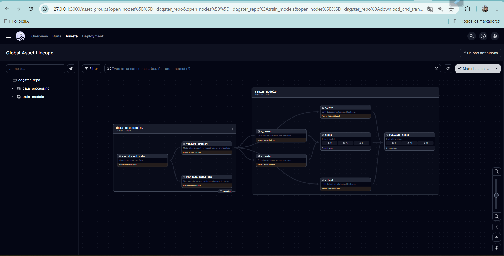
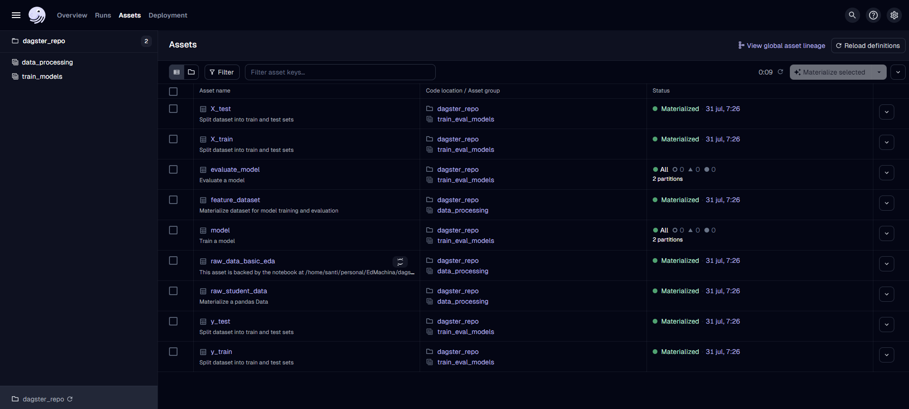
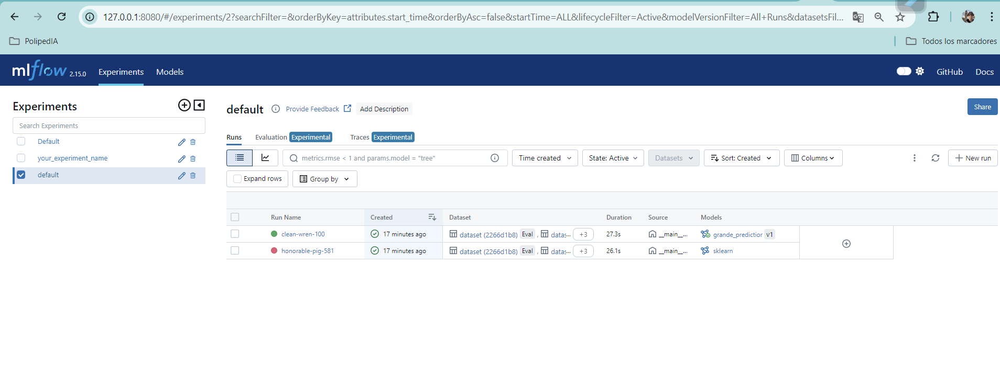
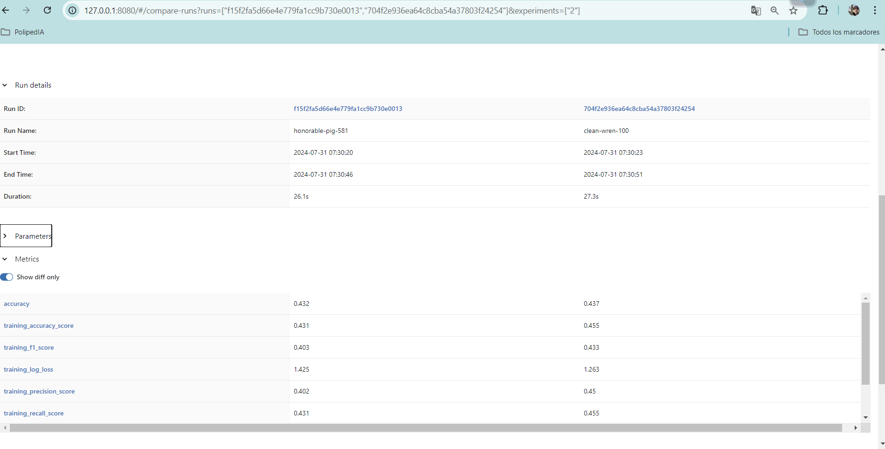

# EdMachina Machine Learning Challenge


## Description
This repository contains the solution for the EdMachina Machine Learning Challenge. The challenge consists of predicting the final grade of studens in a course based on the data provided in the `data` folder.
The focus was to create a pipeline for data preparation, model training, evaluation, and model deployment.

The main tools used in this project are:
- Dagster for pipelines orchestration:
    - Dagster is a data orchestrator that makes it easy to build, schedule, and monitor complex data pipelines.
    - It allows us to define pipelines as a collection of solid functions that can be tested and executed independently.
    - It provides a way to define the inputs and outputs of each solid, making it easier to understand the data flow.
    - It can be easily integrated with other tools like MLflow for model tracking.
    -It can be deployed in a Kubernetes cluster for horizontal and verical scalability.
- Mlflow for model tracking
    Why MLflow?
    - MLflow is an open-source platform for the complete machine learning lifecycle.
    - It allows us to track experiments, log parameters, and metrics, and store artifacts like models and datasets.
    - It provides a way to compare different models and versions of the same model.
    - It provides a way to deploy models in different environments (not the main option propose but a solid alternative for k8s deployment).
- Nvidia Triton Inference Server for model deployment
    - Triton Inference Server is an open-source inference serving software that lets teams deploy trained AI models from any framework (TensorFlow, PyTorch, ONNX, or a custom framework) from local storage, Google Cloud AI Platform, AWS SageMaker, Azure ML, or NVIDIA GPU Cloud (NGC) to any GPU- or CPU-based infrastructure.
    - It provides a way to deploy models in a scalable way, allowing us to serve multiple models in the same server.
    - It provides a way to monitor the models' performance and health.
    - It provides a way to update models without downtime.


## Roadmap
- [x] Create the project structure
- [x] Setup the environment
- [ ] Create dagster repository
    - [x] Create the data preparation pipeline
    - [x] Create the model training pipeline
    - [x] Create the model evaluation pipeline
    - [ ] Create the model deployment pipeline
    - [ ] Create the model performance check pipeline
- [ ] Create app compose:
    - [x] Create sql database for for services support
    - [x] Create mlflow server
    - [ ] Create dagster server
    - [ ] Create triton server
    - [ ] Create logging DB (opensearch probably)
- [ ] Create models Wrapper
    - [ ] Create a model wrapper for for normalize models cicle (training, serving, evaluation, inference logging, etc ..)

## Running the project as developer
1. Create the environment
```sh
	conda env create --file conda.yaml
    conda activate edmachina-ml-challenge
```
2. configure the environment variables
```sh
    DAGSTER_HOME=$(pwd)/dagster_repo/storage
```
2. Install dependencies
```sh
	set -o allexport; source environments/dev.env; set +o allexport 
    pip install -e ".[dev]"
```
4. Run dagster for pipelines orchestration
```sh
    dagster dev
```
5.Run mlflow ui for model tracking
```sh
    mlflow ui --port 8080 --backend-store-uri sqlite:///mlruns.db
```

## Run the app
1. Set the environment variables
```sh
    cp environments/local.env.sample environments/app.env
```

```sh
    docker-compose up
```
## Demo







